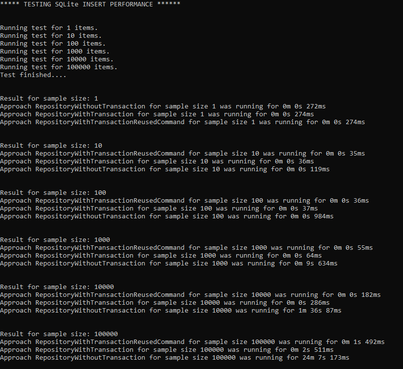

# ADO.NET Sqlite Insert Benchmarking   

Purpose of this project is to show different approaches for inserting a huge number of rows into Sqlite database using [ADO.NET](https://docs.microsoft.com/en-us/dotnet/standard/data/sqlite/?tabs=netcore-cli) provider.

Default approach where each insert is packed in its own transaction has a bad performance and that was the motivation to explore different approaches and measure 
which one has the best performance. Every approach has its own repository class and can be tested individually.

1. Default approach where each insert is commited separately is implemented in repository `RepositoryWithoutTransaction`  class
2. Second approach is to wrap all inserts inside one transaction =>  `RepositoryWithTransaction`  class
3. Second approach can be slightly improved by reusing the same `SqliteCommand` object for every insert => `RepositoryWithTransactionReusedCommand` class

Test was executed for different sample sizes (1, 10, 100, 1k, 10k and 100k) on Dell XPS 9370 with i7 8th Gen processor, 8 GB RAM and SSD Disk.

### Results:

### Conclusion

Clear winner, in total, is the 3rd approach where all inserts are wrapped inside one transaction and they all reuse the same `SqliteCommand`. Only when we are inserting 1 item, in that case the default approach is slightly faster than the other two.
